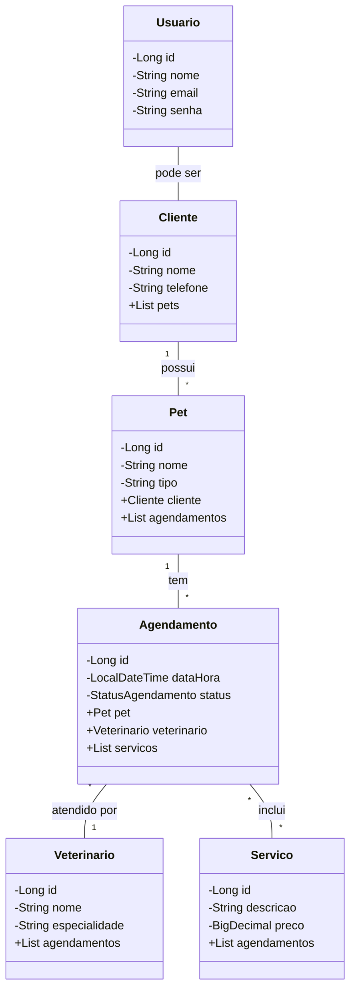

# 🐾 Pet Shop API
Uma API robusta e eficiente para gerenciamento de Pet Shops, desenvolvida com Spring Boot.


## Diagrama de Classes


## 🐶 Sobre o Projeto
A Pet Shop API é uma solução completa para gerenciamento de pet shops, oferecendo funcionalidades para controle de clientes, pets, agendamentos, serviços e veterinários. Com uma arquitetura robusta e segura, a API permite uma gestão eficiente e intuitiva de todas as operações de um pet shop moderno.

## 🐱 Funcionalidades
* Gerenciamento de Clientes
* Cadastro e Controle de Pets
* Agendamento de Serviços
* Gestão de Veterinários
* Catálogo de Serviços
* Autenticação e Autorização com JWT

## 🛠 Tecnologias Utilizadas
* Java 17
* Spring Boot 3.x
* Spring Security
* Spring Data JPA
* PostgreSQL
* H2 Database (para desenvolvimento)
* Swagger / OpenAPI 3.0
* JWT para autenticação

## 📁 Estrutura do Projeto
O projeto segue uma arquitetura em camadas, com separação clara de responsabilidades:

* __controllers__: Endpoints da API<br>
* __services__: Lógica de negócios<br>
* __repositories__: Acesso a dados<br>
* __models__: Entidades do domínio<br>
* __dtos__: Objetos de Transferência de Dados<br>
* __config__: Configurações do Spring e Swagger<br>
* __security__: Configurações e classes relacionadas à segurança<br>

## 🚀 Como Executar
* Clone o repositório<br>
```git clone https://github.com/seu-usuario/pet-shop-api.git```

* Entre no diretório do projeto<br>
```cd pet-shop-api```

* Execute o projeto com Maven<br>
```./mvnw spring-boot:run```

* A API estará disponível em:<br>
```http://localhost:8080```

## 📘 Documentação da API
A documentação completa da API está disponível através do Swagger UI. <br>Após iniciar a aplicação, acesse:

http://localhost:8080/swagger-ui.html

## 🤝 Contribuições
Contribuições são sempre bem-vindas! Sinta-se à vontade para abrir uma issue ou enviar um pull request.

## 📄 Licença
Este projeto está sob a licença MIT. Veja o arquivo LICENSE para mais detalhes.

Desenvolvido com ❤️ por __Lucas Ferreira da Silva__

