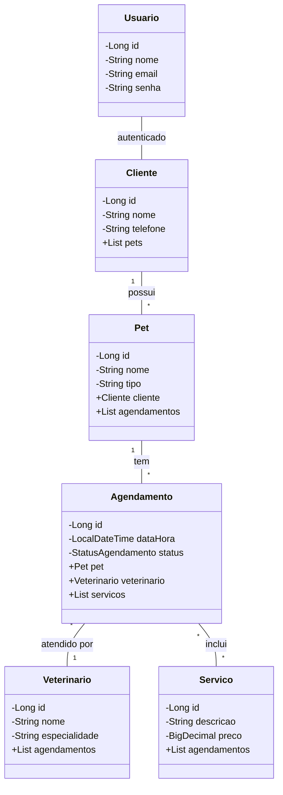

## Diagrama de Classes

```mermaid
classDiagram
    class Cliente {
        -Long id
        -String nome
        -String telefone
        +List<Pet> pets
    }
    
    class Pet {
        -Long id
        -String nome
        -String tipo
        +Cliente cliente
        +List<Agendamento> agendamentos
    }
    
    class Agendamento {
        -Long id
        -LocalDateTime dataHora
        -StatusAgendamento status
        +Pet pet
        +Veterinario veterinario
        +List<Servico> servicos
    }
    
    class Veterinario {
        -Long id
        -String nome
        -String especialidade
        +List<Agendamento> agendamentos
    }
    
    class Servico {
        -Long id
        -String descricao
        -BigDecimal preco
        +List<Agendamento> agendamentos
    }
    
    class Usuario {
        -Long id
        -String nome
        -String email
        -String senha
    }
    
    Cliente "1" -- "*" Pet : possui
    Pet "1" -- "*" Agendamento : tem
    Agendamento "*" -- "1" Veterinario : atendido por
    Agendamento "*" -- "*" Servico : inclui
    Usuario -- Cliente : autenticado


```
