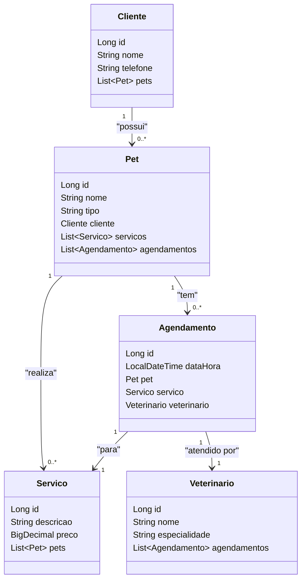

## Diagrama de Classes

```mermaid
classDiagram
    class Cliente {
        Long id
        String nome
        String telefone
        List~Pet~ pets
    }
    
    class Pet {
        Long id
        String nome
        String tipo
        Cliente cliente
        List~Servico~ servicos
        List~Agendamento~ agendamentos
    }
    
    class Servico {
        Long id
        String descricao
        BigDecimal preco
        List~Pet~ pets
    }

    class Agendamento {
        Long id
        LocalDateTime dataHora
        Pet pet
        Servico servico
        Veterinario veterinario
    }

    class Veterinario {
        Long id
        String nome
        String especialidade
        List~Agendamento~ agendamentos
    }

    Cliente "1" --> "0..*" Pet : "possui"
    Pet "1" --> "0..*" Servico : "realiza"
    Pet "1" --> "0..*" Agendamento : "tem"
    Agendamento "1" --> "1" Servico : "para"
    Agendamento "1" --> "1" Veterinario : "atendido por"


```
